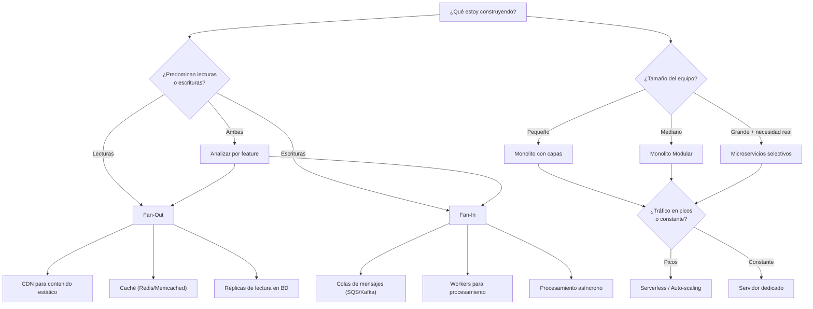

# 🧭 Cuestionario de Diseño de Sistemas

> Responde estas preguntas **antes** de escribir código. Cada respuesta te conduce a decisiones concretas de arquitectura.

> [!NOTE]
> **Encuadre de las respuestas (T-023 / `D-022`).** Las respuestas describen la **INSTANCIA tal como
> está decidida hoy**: un **pipeline batch de ML mono-cliente, instalado por cliente, con gate humano**
> (`D-001`, `D-015`), **no** una plataforma SaaSw multi-tenant en vivo. Este cuestionario está redactado
> para **servicios web distribuidos** (fan-out/fan-in, CDN, Redis, microservicios, cold start); buena
> parte no aplica o aplica distinto a un pipeline por lotes. Donde se marca **N/A** se explica el porqué y,
> cuando es relevante, se anota **cómo cambiaría bajo la visión SaaSw futura**. Respuestas basadas en los
> documentos fuente (`990_documents/`), los 14 briefs (`700_brief/`) y las decisiones (`800_persistence/decisions.md`).

---

## Fase 1 — Entender el Problema

Antes de pensar en herramientas o tecnologías, necesitas entender **qué** estás resolviendo.

### 1.1 Naturaleza del sistema

| # | Pregunta | Tu respuesta |
|---|----------|--------------|
| 1 | ¿Qué problema concreto resuelve este sistema? | Automatizar el trabajo del científico de datos de Sabbia para **planeación de demanda con ML**: un pipeline de **14 flujos** (Discovery→…→Monitoring) que va de datos crudos del cliente (bronze) a limpio (silver) a derivado (gold), entrena un modelo, pronostica **demanda** (no ventas), simula escenarios y produce reportes de negocio. Automatiza el **85–95%** y deja al DS como **revisor/aprobador** del 5–15%. La **instancia** es la solución concreta por cliente. |
| 2 | ¿Quiénes son los usuarios y cuántos esperas tener al inicio? | **Operador principal: 1 científico de datos de la empresa que opera la app Python para N clientes** (revisor/aprobador del gate humano). Consumidor del output: el **planeador de demanda** de cada cliente. Concurrencia de operación ≈ **1** (el DS), pero **N tenants** de datos. Al inicio: pocos clientes (golden client C1, `D-012`/`D-014`), diseñando ya para **N**. |
| 3 | ¿Y a mediano/largo plazo? ¿Esperas crecimiento explosivo o gradual? | Crecimiento **gradual** en **número de clientes (tenants)** atendidos por el mismo DS — esta es la tesis **SaaSw** (de 1 DS ≤4 clientes a 1 DS a muchos). **No** hay crecimiento de concurrencia interactiva. La app debe ser **multi-cliente desde el diseño**: el DS elige el cliente y corre su pipeline. |
| 4 | ¿Los usuarios están concentrados en una región geográfica o distribuidos globalmente? | **Concentrados** (cliente inicial LatAm/Colombia — variables como TRM e inflación lo sugieren, `D-019`). Ojo: la **distribución geográfica está en los DATOS del cliente** (multi-sede: región→país→ciudad→sede, `D-014`), que es *dato a modelar*, no despliegue de usuarios. No hay usuarios globales. |

### 1.2 Patrón de acceso (Fan-out vs Fan-in)

> [!IMPORTANT]
> Esta es **la pregunta más importante** según los videos. La respuesta determina casi toda la arquitectura.

| # | Pregunta | Tu respuesta |
|---|----------|--------------|
| 5 | **¿Cómo interactúan los usuarios con los datos?** ¿Predominan las **lecturas** o las **escrituras**? | **Ninguna de las dos en el sentido transaccional**: es un **pipeline batch de procesamiento**, no un servicio de tráfico. Dentro de cada corrida predomina la **escritura en ráfaga** (cada flujo genera artefactos por capa) seguida de **lecturas del DS** al revisar. Sin usuarios concurrentes ⇒ el eje fan-out/fan-in prácticamente **no aplica**; el eje real es **throughput de un job por lotes**. |
| 6 | Si predominan las lecturas: ¿Muchos usuarios leen el **mismo dato** (ej: Netflix) o cada usuario ve **datos distintos** (ej: dashboard personalizado)? | **N/A** — mono-tenant: cada instancia solo ve **sus propios** datos y artefactos. No hay muchos usuarios leyendo el mismo dato. (Bajo SaaSw multi-tenant sería "cada tenant ve datos distintos" → aislamiento por tenant, no caché compartida.) |
| 7 | Si predominan las escrituras: ¿Un solo origen escribe mucho (ej: sensor IoT) o muchos usuarios escriben poco cada uno pero en total es masivo? | **Un solo origen** (el propio pipeline) escribe mucho **en ráfagas por corrida** (batch periódico, p. ej. mensual). Análogo al "sensor que escribe mucho", no a "muchos usuarios escribiendo poco". |
| 8 | ¿Hay **features** del producto que sean de alta lectura **y** otras de alta escritura? ¿Cuáles? | Sí, por flujo: **escritura pesada** = Ingestion/Cleaning/Derivation/Featuring/Modelling (transforman capas, entrenan modelos). **Lectura pesada** = Reporting/Monitoring (el DS/planeador consulta resultados). **bronze** es *write-once / read-many* e **inmutable** (invariante `D-020`). |

> [!TIP]
> No pienses en el sistema completo como "todo lectura" o "todo escritura". Cada **característica del producto** puede tener un patrón de acceso diferente. Netflix es de alta lectura para streaming, pero de alta escritura para tracking de actividad de usuarios.

---

## Fase 2 — Definir la Arquitectura Base

### 2.1 Punto de partida

| # | Pregunta | Tu respuesta |
|---|----------|--------------|
| 9 | ¿Cuántas personas tiene el equipo de desarrollo? | **Pequeño**: el equipo que construye el **motor** (usuario + agentes de Claude Code). Cada **instancia** la opera **1 DS**. No hay equipos independientes por dominio. |
| 10 | ¿Tienes dominios de responsabilidad claramente separados en el equipo? | **En el dominio sí, en el equipo no.** Hay 14 dominios funcionales claros (los flujos) + transversales `TR-1..TR-4` (`D-020`), pero un solo equipo pequeño los construye. La separación es **modular**, no organizacional. |
| 11 | ¿Los requisitos del negocio están bien definidos o cambian constantemente? | **Evolucionan por diseño**: fase MVP / **walking skeleton** (`D-015`). El *qué* (14 flujos, contrato de datos `D-018`) está definido; el *cómo/cuánto* madura por **bandas** (Tracer Bullet → … → Final, `D-017`). Requisitos estables en el contorno, cambiantes en la profundidad. |
| 12 | ¿Estás construyendo desde cero o migrando algo existente? | **Desde cero (greenfield)**, pero **replicando un proceso manual existente** (el del DS de Sabbia). No hay código legado a migrar; sí un know-how a codificar. |

### 2.2 Selección de patrón arquitectónico

Responde en orden. La primera respuesta afirmativa te da tu punto de partida:

| # | Pregunta | Si la respuesta es SÍ → | Tu respuesta |
|---|----------|--------------------------|--------------|
| 13 | ¿El equipo es pequeño (< 8-10 personas)? | **→ Monolito** (con buenas prácticas) | **SÍ.** Equipo pequeño ⇒ punto de partida = **monolito** (un solo ejecutable/paquete por instancia). |
| 14 | ¿Estás en fase de prototipo o MVP donde los requisitos cambian mucho? | **→ Monolito con capas** (transporte, dominio, datos) | **SÍ.** MVP/walking skeleton (`D-015`) ⇒ **monolito por capas**. Encaja natural: capa **datos** = bronze/silver/gold; capa **dominio** = lógica de cada flujo (limpieza, features, modelado); capa **transporte** = CLI/orquestador batch + gate humano. |
| 15 | ¿Los requisitos son estables y necesitas alta mantenibilidad? | **→ Considerar Clean / Hexagonal** | **Parcialmente / a futuro.** Un principio **hexagonal ligero** sí ayuda: como un **agente invoca código determinista**, conviene separar el **dominio** (lógica ML pura) de la **infraestructura** (I/O del motor de datos) con **puertos/adaptadores**. Así se puede cambiar el motor físico de datos (pregunta 27+) sin tocar la lógica. Adoptarlo **ligero**, no ceremonioso. |
| 16 | ¿El equipo es grande y el monolito ya muestra fricción entre equipos? | **→ Monolito Modular** | **SÍ, pero por dominio, no por equipo.** El monolito debe ser **modular**: cada flujo = un **módulo** con su celda `agents/skills/schemas/contract/deliverables/evaluation` (`D-021 §4`). La modularidad viene de los 14 flujos, no de la fricción entre equipos. |
| 17 | ¿Hay módulos con necesidades de escalabilidad muy distintas al resto? | **→ Extraer esos módulos a Microservicios** | **NO** (ver warning). Modelling (torneo de campeones) es el más pesado, pero se resuelve **en batch**, no con un microservicio en vivo. **No empezar por microservicios.** |
| 18 | ¿Tienes ingesta masiva de eventos o necesitas separar comandos de consultas? | **→ Considerar CQRS** | **NO ahora.** La ingesta es **batch**, no streaming de eventos. No hay presión de separar comandos/consultas. (La inmutabilidad bronze/silver/gold ya da un beneficio tipo *read-model* sin CQRS formal.) |

> [!WARNING]
> **Nunca empieces directamente con microservicios.** Martin Fowler y Sam Newman coinciden: empieza con monolito → hazlo modular → extrae a microservicios solo cuando sea un problema real.

### 2.3 Modelo de despliegue

| # | Pregunta | Tu respuesta |
|---|----------|--------------|
| 19 | ¿Tu tráfico es constante o viene en **picos** pronunciados? | **Picos** (o más bien **ejecuciones puntuales**): corridas por período (p. ej. mensual) o bajo demanda, con **gates humanos** intercalados. **Idle** la mayor parte del tiempo. |
| 20 | Si es constante: ¿has evaluado el costo de un servidor dedicado vs serverless? | **N/A** (no es constante). Nota: para un batch idle, un **proceso local / job programado** es más barato que un servidor 24/7. |
| 21 | Si es en picos: ¿necesitas escalar a cero cuando no hay tráfico? | **Sí, y ya lo hace "gratis":** al ser **batch CLI**, no hay servidor corriendo entre corridas ⇒ **escala a cero** de forma natural. Sin costo en reposo. |
| 22 | ¿La latencia del cold start es aceptable para tu caso de uso? | **Totalmente aceptable.** Es batch; segundos de arranque son irrelevantes frente a minutos de entrenamiento/simulación. |

> [!TIP]
> **Serverless ≠ Microservicios.** Puedes tener un monolito en Lambdas o microservicios en un servidor dedicado. Son decisiones ortogonales.

---

## Fase 3 — Estrategia de Escalabilidad

### 3.1 Escalado de servidores

| # | Pregunta | Tu respuesta |
|---|----------|--------------|
| 23 | ¿Un solo servidor puede manejar la carga esperada actualmente? | **Sí.** Una sola máquina (la del DS o un runner) procesa una instancia mono-cliente. C1 es pequeño (~5–10 series, mensual, ~24–36 meses); C4 es el fixture de estrés (`D-014`). |
| 24 | Si no: ¿puedes resolver **escalando verticalmente** (más CPU/RAM) o necesitas **escalar horizontalmente** (más máquinas)? | **Vertical** si acaso (más RAM/CPU para datasets grandes o para el torneo de Modelling). **No horizontal**: no hay concurrencia que repartir. El paralelismo útil es **intra-job** (entrenar varios modelos a la vez), no multi-máquina. |
| 25 | Si escalas horizontalmente: ¿tus servidores tienen **estado** (archivos locales, sesiones en memoria)? | **Sí, y es intencional:** el estado **es el producto** — capas bronze/silver/gold en disco, artefactos `*.json`/`*.yaml`, `best_model.pkl`, y la **persistencia de runtime `fda-*`** (`D-004`). Un pipeline de datos es inherentemente *stateful*; no se busca replicarlo stateless. |
| 26 | ¿Puedes hacer tus servidores **stateless** delegando estado a BD o almacenamiento externo (ej: S3)? | **Sí, y ahora es la dirección elegida:** el estado (bronze/silver/gold + metadatos) vive en **PostgreSQL**, no en disco local de un runner. Así la app Python es (casi) **stateless** y el mismo DS opera **N clientes** contra la misma BD. El acceso a datos va **detrás de un puerto/repositorio** (pregunta 15) para no acoplar la lógica ML a Postgres. |

> [!CAUTION]
> **Servidores con estado (stateful) son el enemigo de la escalabilidad horizontal.** Si guardas archivos en disco local o sesiones en memoria, no podrás añadir réplicas fácilmente. Delega el estado a una base de datos o a un servicio externo como S3.

### 3.2 Escalado de base de datos

| # | Pregunta | Tu respuesta |
|---|----------|--------------|
| 27 | ¿La base de datos es actualmente un cuello de botella? | **No** (volumen por cliente moderado), y la **BD ya está decidida: PostgreSQL**. bronze/silver/gold viven como **esquemas/tablas en Postgres**, aislados **por cliente (tenant)**. Postgres da transaccionalidad, consultas SQL para Profiling/Exploration y aislamiento por esquema — suficiente para N clientes operados por 1 DS. |
| 28 | ¿Hay datos que se leen mucho pero cambian poco? → **candidatos a caché** | **Sí, y ya están modelados como inmutables:** **bronze** (crudo inalterable) y los **snapshots por capa/artefacto** del golden client (`D-012`) son de facto una **caché por congelado**. La inmutabilidad *es* la estrategia de caché. |
| 29 | ¿Las lecturas y escrituras compiten por los mismos recursos? → **considerar réplicas de lectura** | **No** — sin concurrencia, no hay contención lectura/escritura. Réplicas de lectura **innecesarias**. |
| 30 | ¿El volumen de datos es tan grande que una sola instancia no lo puede almacenar? → **considerar sharding** | **No sharding técnico**, pero **sí particionado lógico por cliente (tenant)** dentro de Postgres — es el eje natural del negocio (`D-001`). Estrategia de aislamiento (esquema-por-cliente vs. BD-por-cliente vs. `tenant_id`) = decisión abierta de T-023 (ver Síntesis). |

### 3.3 Estrategia de caché

| # | Pregunta | Tu respuesta |
|---|----------|--------------|
| 31 | ¿Qué datos son **candidatos a caché** (se leen mucho, cambian poco)? | Los **snapshots por capa/artefacto** (`D-012`), **bronze** (inmutable) y el **`best_model.pkl`** seleccionado. Todo se lee muchas veces (revisión, flujos downstream) y cambia solo en una nueva corrida. |
| 32 | ¿Cuál es la **tolerancia a datos desactualizados**? ¿Segundos, minutos, horas? | **Muy alta** — **días/semanas**. La planeación de demanda opera por **período** (típ. mensual). No hay ningún requisito de tiempo real. |
| 33 | ¿Qué estrategia de invalidación usarás? (por tiempo TTL / al escribir / manual) | **Al cambiar el contrato upstream / nueva corrida**: el snapshot se **versiona ligado al contrato** que lo produjo (`D-012`). **No TTL** — la invalidación es por *cambio de entrada*, no por reloj. |
| 34 | ¿Necesitas caché en memoria del servidor, un servicio externo (Redis/Memcached), o ambos? | **Ninguno.** La "caché" son **snapshots en disco**. Redis/Memcached serían complejidad sin beneficio en un batch mono-usuario. |

> [!NOTE]
> Si tu sistema tiene muchas escrituras, la caché puede ser **contraproducente** porque cada escritura la invalida, forzando refrescos constantes.

### 3.4 Distribución geográfica

| # | Pregunta | Tu respuesta |
|---|----------|--------------|
| 35 | ¿Tus usuarios están en múltiples regiones geográficas? | **No.** Usuarios concentrados. (La multi-región vive en los **datos** del cliente, no en el despliegue — ver pregunta 4.) |
| 36 | ¿Tienes contenido estático (HTML, CSS, JS, imágenes, video) que puedas servir desde una CDN? | **No aplica.** No es una web app con assets. Los **reportes** (070) son **artefactos de datos** (`.json`/`.csv`/`.xlsx`), no assets servidos a navegadores. **CDN innecesaria.** |
| 37 | ¿La latencia por distancia física está afectando la experiencia del usuario? | **No aplica** — sin tráfico interactivo remoto. |

---

## Fase 4 — Procesamiento Síncrono vs Asíncrono

| # | Pregunta | Tu respuesta |
|---|----------|--------------|
| 38 | ¿Hay operaciones que tardan demasiado para hacerse de forma síncrona (>2-3 segundos)? | **Sí, casi todas las pesadas:** entrenamiento del **torneo de modelos** (050), **Montecarlo** de Simulation (060), ingestión y derivación de datos. Son inherentemente **de minutos**, batch por naturaleza. |
| 39 | ¿El usuario **necesita** la respuesta inmediatamente o puede esperar? | **Puede esperar.** El modelo es **asíncrono por diseño**: hay **gates humanos** entre flujos (el DS aprueba el modelo en Modelling, etc.). Nadie espera una respuesta interactiva. |
| 40 | Si puede esperar: ¿cómo le notificarás que su proceso terminó? (email, notificación push, polling, websocket) | Vía la **persistencia de estado + trazabilidad**: al terminar un flujo, el DS **revisa los artefactos** y el estado de progreso (`project-progress`, `D-004`). Hoy = **inspección del estado/logs (polling manual)**; **a futuro** una notificación (email/webhook) al llegar a un gate. **No websockets.** |
| 41 | ¿Hay operaciones pesadas que podrían beneficiarse de procesarse en segundo plano con una **cola de mensajes**? | **No ahora.** La orquestación es una **secuencia de flujos con checkpoints** (durabilidad diferida en el andamiaje transversal, `D-020`). Un **orquestador batch** basta; una cola distribuida (SQS/Kafka) es sobreingeniería para un job secuencial mono-cliente. (SaaSw multi-tenant *sí* podría usar una cola de *jobs por cliente*.) |
| 42 | ¿Cuántos **workers** necesitas para consumir la cola a velocidad aceptable? | **1** (ejecución secuencial de la tubería). Único paralelismo con sentido: **intra-Modelling** (entrenar varios candidatos en paralelo), a futuro. |

> [!TIP]
> Las colas te permiten **controlar la velocidad de procesamiento** y sobrevivir picos de tráfico sin devolver errores al usuario. En vez de "servidores sobrecargados", el usuario ve "tu solicitud está en proceso".

---

## Fase 5 — Resiliencia y Tolerancia a Fallos

| # | Pregunta | Tu respuesta |
|---|----------|--------------|
| 43 | ¿Qué pasa si un servidor o servicio se cae? ¿El sistema sigue funcionando parcialmente? | Al ser **batch con persistencia por capa/checkpoint**, se **reanuda desde el último snapshot/artefacto**. La **inmutabilidad bronze/silver/gold** permite **re-ejecución idempotente** de un flujo sin corromper lo anterior (invariante `D-020`). No es "alta disponibilidad" — es **reanudabilidad**. |
| 44 | ¿Tienes **timeouts** configurados en todas las llamadas entre servicios? | Internamente **no hay red** entre "servicios" (es un monolito). Donde **sí importan** los timeouts es en las llamadas al **proveedor LLM** (los agentes) y a **APIs externas del cliente** durante Ingestion. Conviene timeouts ahí. Parte del **andamiaje transversal** (`TR-*`, `D-020`). |
| 45 | Si un servicio externo falla repetidamente: ¿tienes un **circuit breaker** para dejar de llamarlo? | Relevante solo para **LLM/API externas**; **diferible** al andamiaje transversal (no es invariante del Tracer Bullet, `D-020`). |
| 46 | ¿Tienes **reintentos** con backoff para fallos transitorios? | **Sí, deseable** para llamadas **LLM/API** (rate limits, cortes transitorios). Parte del andamiaje transversal; escalonado por bandas. |
| 47 | ¿Qué experiencia recibe el usuario cuando algo falla? ¿Pantalla en blanco o mensaje útil? | **Mensaje útil + estado persistido**: el DS ve **en qué flujo/artefacto** falló (trazabilidad por artefactos, cada flujo documenta su transformación). Es **CLI/logs**, no pantalla en blanco. |

> [!CAUTION]
> Sin timeouts, un servicio caído puede arrastrar a todo el sistema. Un servicio que espera indefinidamente una respuesta que nunca va a llegar se convierte en otro servicio caído.

---

## Fase 6 — Observabilidad

> Un sistema distribuido sin observabilidad es como conducir un coche a ciegas.

### 6.1 Los tres pilares

| # | Pregunta | Tu respuesta |
|---|----------|--------------|
| 48 | **Logs**: ¿Tus logs son estructurados y consultables? ¿Incluyen ID de usuario, servidor, contexto? | **Objetivo sí.** Cada flujo deja **trazabilidad estructurada**: los artefactos `*.json`/`*.yaml` documentan las transformaciones (auditar = leer el artefacto). Logs con **id de cliente / flujo / corrida (`run_id`)**. **Observabilidad mínima** es invariante; lo sofisticado se difiere (`D-020`). |
| 49 | **Métricas**: ¿Estás midiendo latencia, disponibilidad, tasa de errores, uso de recursos? | Dos niveles. **Negocio** (ya en el contrato): **MAPE por período** (055), márgenes, costo de oportunidad, inventario de seguridad (070) — de hecho **Monitoring/Alerting (075) son flujos del propio pipeline**. **Sistema** (duración por flujo, fallos): **mínimo** al inicio, se afina por bandas. |
| 50 | **Trazas**: ¿Puedes seguir una petición completa a través de múltiples servicios con un ID único? | **Sí, deseable:** un **`run_id`** que correlacione una corrida a través de los 14 flujos y sus artefactos. **Diferible** en sofisticación, pero encaja natural con el modelo de artefactos encadenados. |

### 6.2 Monitoreo activo

| # | Pregunta | Tu respuesta |
|---|----------|--------------|
| 51 | ¿Tienes alertas configuradas para cuando las métricas superen umbrales críticos? | **Sí, como producto**: el flujo **075 (Monitoring + Alerting)** cubre alertas **de negocio** (deriva del modelo, MAPE fuera de umbral → `alerting.json`). Alertas **de sistema** (job caído) son diferibles al andamiaje. |
| 52 | ¿Puedes diagnosticar un problema de un usuario específico consultando tus logs? | **Trivial:** cada instancia es **mono-cliente**, y los **artefactos por capa** permiten auditar exactamente en qué transformación se originó un problema. |
| 53 | ¿Tienes dashboards para ver de un vistazo la salud general del sistema? | **De negocio sí** (Reporting 070 es el output para el planeador; Profiling 025 da un "índice de salud de datos"). **Dashboard de salud del *sistema*** (jobs, latencias): **diferible**. |

---

## 🗺️ Mapa de Decisión Rápido

> **Dónde cae FODA en este mapa:** rama derecha **Equipo pequeño → Monolito (modular, con capas)**; rama de
> tráfico **Picos → escala-a-cero** (batch CLI, no serverless-web). La rama izquierda (fan-out/fan-in) **no
> gobierna** el diseño porque no hay tráfico de usuarios: el sistema es un **job por lotes**, no un servicio.

---

## ✅ Checklist Final Pre-Desarrollo

Antes de empezar a construir, verifica que puedes responder:

- [x] Sé si mi sistema es predominantemente de lectura o escritura (o ambos por feature) → **Ninguno: es batch; escritura en ráfaga + lectura del DS. Sin tráfico concurrente.**
- [x] Elegí un patrón arquitectónico con criterio, no por moda → **Monolito modular por capas (14 módulos = flujos), con puertos/adaptadores ligeros para el acceso a datos.**
- [ ] Mis servidores serán stateless → **No aplica / consciente: el estado *es* el producto (capas bronze/silver/gold). Stateless se pospone a la fase SaaSw (delegar a object storage).**
- [x] Tengo una estrategia de caché (o decidí conscientemente no necesitar una) → **Caché = inmutabilidad + snapshots por capa (`D-012`). Sin Redis.**
- [x] Sé si necesito procesamiento asíncrono y cómo notificaré al usuario → **Todo es asíncrono/batch con gate humano; notificación = revisión del estado/artefactos (polling), webhook a futuro.**
- [x] Tengo definida mi estrategia de observabilidad (logs, métricas, trazas) → **Mínima al inicio: logs estructurados con `run_id`, artefactos como traza, MAPE/deriva como métricas de negocio (075). Afinada por bandas (`D-020`).**
- [x] Consideré la resiliencia: timeouts, reintentos, circuit breakers → **Reanudabilidad por checkpoints + idempotencia por capa. Timeouts/retries/CB solo en el borde LLM/API externa; diferidos al andamiaje transversal.**
- [x] Mi modelo de despliegue se ajusta a mi patrón de tráfico y presupuesto → **Batch CLI que escala a cero en reposo; cero costo idle.**
- [x] Si tengo usuarios globales, consideré CDN y distribución geográfica → **No hay usuarios globales; multi-región vive en los datos, no en el despliegue. Sin CDN.**

---

## 🎯 Síntesis para T-023 — las 4 decisiones que faltan por cerrar (`D-022`)

Este cuestionario confirma el **perfil arquitectónico** (monolito modular batch mono-cliente, stateful por
diseño, escala-a-cero, sin caché externa ni microservicios). Con eso, T-023 aún debe fijar como ADRs
(`D-023+`) los **4 puntos de implementación** de `D-022`. Recomendación derivada de las respuestas:

| # | Decisión pendiente | Recomendación derivada del cuestionario (a validar con el usuario) |
|---|--------------------|--------------------------------------------------------------------|
| 1 | **Lenguaje + librerías de ML** | **Python** (confirmado por el usuario). Stack a detallar: pandas/polars para datos, scikit-learn + libs de series de tiempo para el torneo de Modelling, numpy para Montecarlo, SQLAlchemy/psycopg para el acceso a Postgres. |
| 2 | **Motor de datos físico de bronze/silver/gold** | **PostgreSQL** (confirmado por el usuario). bronze/silver/gold como **esquemas/tablas**, con **aislamiento por cliente (tenant)**. bronze inmutable = tablas de solo-inserción/versionadas. **Abierto:** modelo de aislamiento multi-tenant (ver fila 5). |
| 3 | **Forma de la app** | **App Python batch operada por el DS para N clientes**: CLI/orquestador donde el DS **selecciona el cliente** y corre su pipeline, con **gate humano** en los checkpoints. **No** servicio web con API en esta fase; la multi-cliente se logra por **selección de tenant**, no por concurrencia. |
| 4 | **Patrones de diseño base** | **Monolito modular por capas + multi-tenant** (transporte CLI / dominio por flujo / datos por capa) + **hexagonal ligero**: acceso a Postgres detrás de un **repositorio/puerto** con el `tenant` como parámetro transversal, para no acoplar la lógica ML al esquema. El agente invoca **código determinista** en el módulo del flujo (`skills/` de la celda, `D-021 §4`). |
| 5 | **Modelo de aislamiento multi-tenant en Postgres** *(nuevo — abierto)* | Tres opciones (ver pregunta al usuario): **esquema-por-cliente** (recomendado: 1 servidor Postgres, un `schema` por cliente), **BD-por-cliente** (aislamiento máximo, más admin) o **`tenant_id` en tablas compartidas** (ops más simple, aislamiento más débil). Debe **reconciliarse con `D-001`** (carpeta por cliente): la carpeta guarda config/artefactos; los **datos** viven en Postgres por tenant. |

> **Siguiente paso sugerido:** cerrar la decisión de aislamiento (fila 5), convertir la síntesis en
> `D-023..D-027` en `800_persistence/decisions.md` (una por punto), desbloquear **T-014** (el generador del
> golden client emitiría bronze directo a Postgres) y actualizar `progress.md`/`tasks.md`.

---

> [!NOTE]
> **Fuentes**: Este cuestionario fue construido a partir de los conceptos de tres videos:
> - [Video 1](https://youtu.be/2nEiIG-xca4): Todo lo que necesitas saber sobre diseño de sistemas en 24 minutos
> - [Video 2](https://youtu.be/dbLQ_0Ivg4U): El Diseño de Sistemas era Difícil hasta que Aprendí Esto
> - [Video 3](https://youtu.be/q3YQy1lJutw): Cada Patrón de Arquitectura Explicado en 18 Minutos
